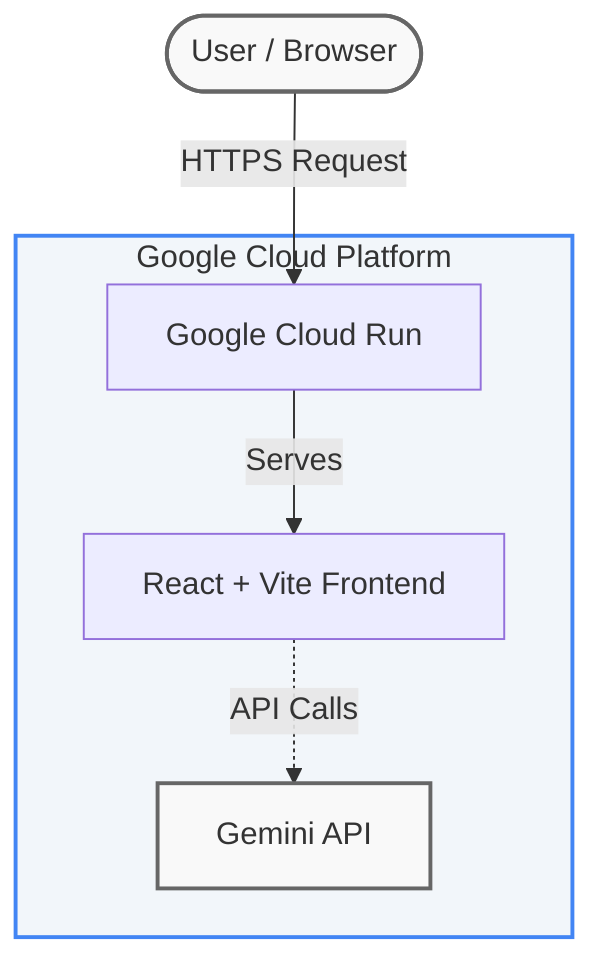
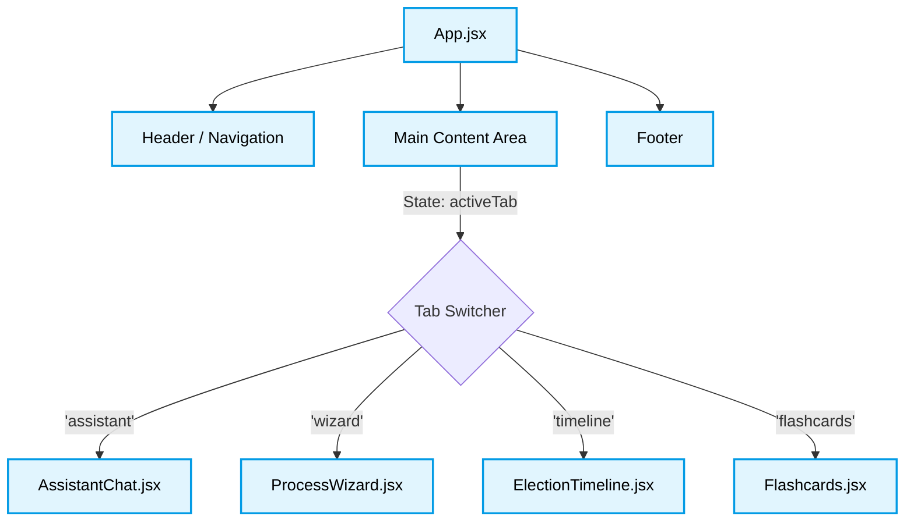

# 🇮🇳 India-Elects

An interactive and neutral **Election Information Assistant** designed to guide individuals through the world's largest democratic process. This application is built with React and deployed on Google Cloud Run, powered by the Gemini API to provide intelligent, conversational responses.


---

## 🌟 Features

India-Elects is divided into four main interactive modules:

1. **AI Assistant (`AssistantChat`)**: A conversational bot powered by Gemini, designed to answer specific questions regarding election dates, voter eligibility, and polling stations in a strictly neutral and informational manner.
2. **Voter Guide (`ProcessWizard`)**: A step-by-step wizard guiding new voters through the registration and voting process.
3. **Timeline (`ElectionTimeline`)**: A chronological view of key election events, phases, and result declarations.
4. **Learn Terms (`Flashcards`)**: Interactive flashcards to help users familiarize themselves with common electoral terminology (e.g., EVM, VVPAT, Model Code of Conduct).

---

## 🏗️ Architecture & Component Diagrams

### System Architecture

The application is a containerized frontend deployed seamlessly on Google Cloud Run, leveraging the Gemini API for its intelligent chat capabilities.



### Component Structure

A breakdown of the React components that make up the user interface:



---

## 🚀 Local Development

This template provides a minimal setup to get React working in Vite with Hot Module Replacement (HMR).

### Prerequisites
- Node.js (v18+)
- A Gemini API Key (Set up your `.env` file with `VITE_GEMINI_API_KEY`)

### Setup Instructions

1. **Clone the repository:**
   ```bash
   git clone https://github.com/onemoremohit/India-Elects.git
   cd India-Elects
   ```

2. **Install dependencies:**
   ```bash
   npm install
   ```

3. **Start the development server:**
   ```bash
   npm run dev
   ```

4. **Build for production:**
   ```bash
   npm run build
   ```

---

## ☁️ Deployment (Google Cloud Run)

This project includes a `Dockerfile` and `nginx.conf` for optimized production serving.

```bash
# Set your Google Cloud project
gcloud config set project [YOUR_PROJECT_ID]

# Deploy directly from source
gcloud run deploy promptwar2 \
  --source . \
  --region us-central1 \
  --allow-unauthenticated
```
